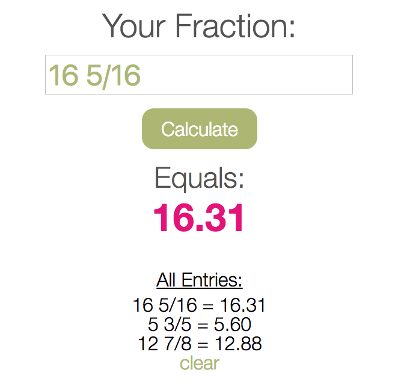

# Eden's Calculator

A _very_ simple calculator that takes an input of a fraction and converts it to a decimal. My sister wanted it - something having to do with calculating box sizes for her move. I don't know.

It has a simple display so it is easy to see and use on her phone. Press enter or click the button to calculate. At her request, previous entries are also displayed. They are sorted most recent on top. Error message displayed if you try to calculate with invalid input.

